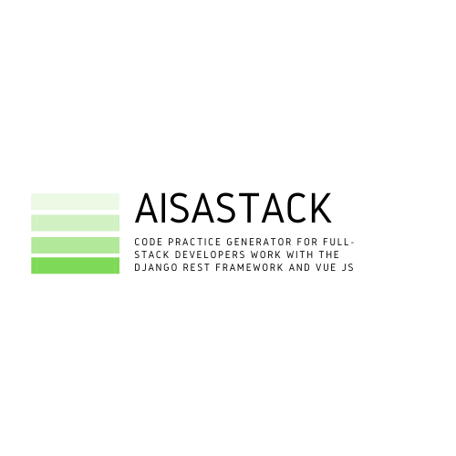

# AisaStack

Generator tools for Full-Stack Developers work with the Django Rest Framework and Vue JS.

## Motivation

Motivation 01:

> Build modular programs, Eric Raymond's 17 Unix Rules

Motivation 02:

> Small is beautiful, Make each program do one thing well, Mike Gancarz The UNIX Philosophy

In DRF we actually use ViewSet, in our opinion it is something that approaches the motivation above.
You can see how this works [here](https://github.com/aisahana/eclinic_api).

## Include Frontend Framework
- Vue JS

## Installation
With pip:

```
$ pip install vuelstack
```

or manual install with clone this project:

```
$ cd vuelstack
$ python setup install
```

## Stack Name Available
There are several UI stack available:

- `blight` : Bootstrap 4 Admin Light (vue) (you can see the package.json for detail dependencies).
- `nativescript` : NativeSacript Vue (coming soon)


## How To
Command to do a clone:

```
$ aisvue --clone <stack-name>
$ cd <stack-name>
```

Creat app:

```
$ aisvue --build <stack-name>
```

A prompt will appear that you can fill in with the model name in the Django Rest backend.